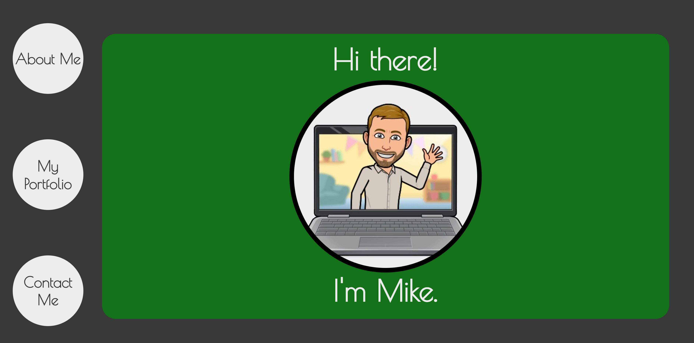
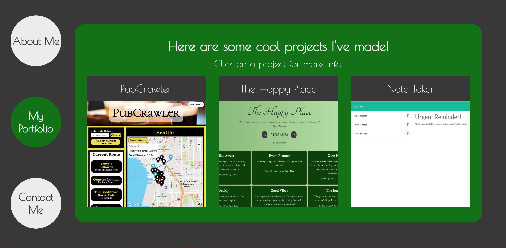
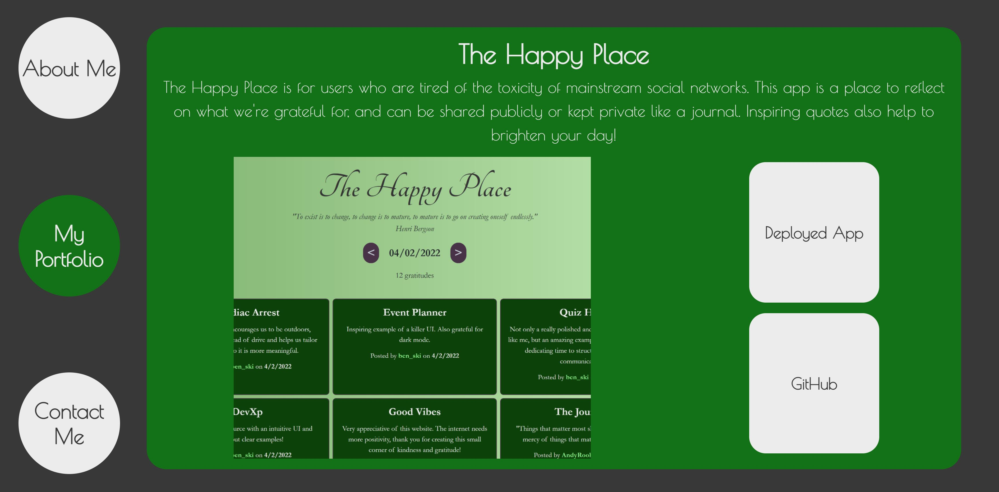
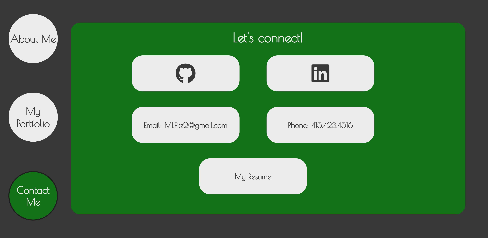

# Professional-Portfolio-3

Deployed Site: https://mlfitz2.github.io/Professional-Portfolio-3/

GitHub Repository: https://github.com/mlfitz2/Professional-Portfolio-3

# Description
This portfolio is a reworking of the previous one, using a more dynamic interface. It contains an About Me Section and some links to contact me, along with a portfolio to display a few projects. The Contact Me section includes links to LinkedIn, GitHub, email and phone info, and a downloadable PDF of my resume. 

# Technologies
The site was built using HTML, CSS and JavaScript. 

# Screenshots

